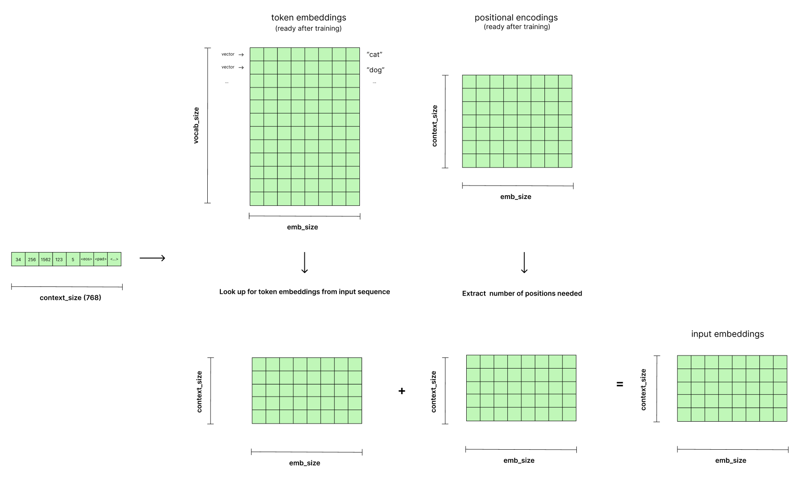

## Transformer architecture

## Learning materials

1. [GPT 2 illustrated article](https://jalammar.github.io/illustrated-gpt2/)
2. [LLM visualizations](https://bbycroft.net/llm)
3. [Positional encoding](https://medium.com/@hunter-j-phillips/positional-encoding-7a93db4109e6)
4. [Open AI implementation](https://github.com/openai/gpt-2)

---

## Tokenizer

**BPE - Byte Pair Encoding**

Vocabulary:
Vocabulary is built iteratively during training.
Starts with all unique characters in training data + special tokens (<unk>, <pad>, <eos> ...).

input: raw text
output: sequence of tokens

Steps:

Training:

1. Split into words (to identify the word boundaries if needed)
   - grammatical meaning
   - semantic meaning
2. Pair counting
3. Merge most frequent pair
4. Update vocabulary
5. Mapping with indexes (= index of vocabulary array)
6. Repeat until vocabulary size is reached

Inference:

1. Identify max_length (context length), batch_size hyperparameters
2. Split into words (if needed)
3. Tokenize
4. Convert tokens to IDs
5. Split into sequences of max_length
6. Pad and truncate to max length (context length)
7. Feed to model (each sequence will be processed independently by transformer)


---

## Embedding layer

Hyperparameters:

- embedding_dim
  GPT-2 small: 768
  GPT-2 medium 1024
  GPT-2 large 1280
  GPT-2 XL 1600

- context_length
  GPT-2 small: 768
  GPT-2 medium 1024
  GPT-2 large 1280
  GPT-2 XL 1600

**Positional encoding:**

- each position should have a unique representation
- tensor is a constant tensor, should be saved with a model
- sinusoidal positional encoding uses formula:


**Training:**

1. Init positional encoding matrix with random values
2. Init token embedding matrix with random values

**Inference:**

Token embeddings + positional embeddings = input embeddings

1. Token embeddings lookup. Each index in the token embedding matrix encodes a corresponding token from tokenizer vocabulary.
2. Positional embeddings lookup.
3. Sum of token embeddings and positional embeddings = input embeddings
4. Truncate or pad input embeddings to context length



## Attention

** Layer Normalization:**

_Purpose_

- stabilize learning
- speedup training
- prevent gradient explosion or vanishing

_Analogue_

Imagine teaching a class of students.

**No Normalization:** Each student's understanding of previous topics is all over the place. Some are way ahead, some are far behind. It's hard to teach new material effectively because you have to constantly adjust to the wildly varying levels of understanding. Some students get overwhelmed (exploding gradients), others get lost and disengaged (vanishing gradients).

**Layer Normalization:** Before teaching each new topic, you give a quick "leveling" exercise to ensure everyone has a roughly similar baseline understanding of the prerequisite concepts. This makes it much easier to teach the new topic effectively and at a faster pace. The students are less likely to get completely lost or overwhelmed, and learning becomes more stable and efficient.

_How it works_

1. Calc the mean:

   Input: [1, 2, 3, 4]
   Output: m = 2.5

2. Calc standard deviation:

   Input: [1, 2, 3, 4]
   Output: st_d = 1.118

3. Normalize:

   x_i_norm = (x_i - m) / st_d
   applying:
   [1, 2, 3, 4] -> [-1.341, -0.447, 0.447, 1.341]

4. Shift and scale:

   x_i_scaled = x_i_norm \* scale + shift
   applying:
   [-1.341, -0.447, 0.447, 1.341] -> [-2.182, -0.394, 1.394, 3.182]

---

## Q&A

1. When to inherit from nn.Module?

   - when need parameter management
   - when include other modules with parameters

2. When to use register_buffer?

   - when need to save a constant tensor with a model
   - when tensor should not receive any gradients during backprop

3. How to get from original position encoding formula:


to adaptation in pytorch:

```positions = torch.arange(CONTEXT_SIZE).unsqueeze(1)
        div_term = torch.exp(
            torch.arange(0, EMBEDDING_DIM, 2) * -(torch.log(PE_N) / EMBEDDING_DIM)
        ).unsqueeze(0)

        pe[:, 0::2] = torch.sin(positions * div_term)
        pe[:, 1::2] = torch.cos(positions * div_term)
```

using 

apply transformations:

