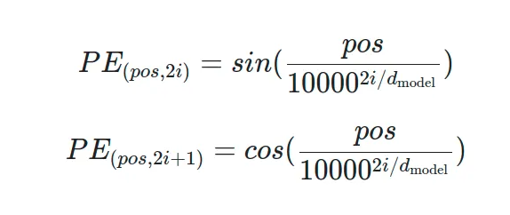
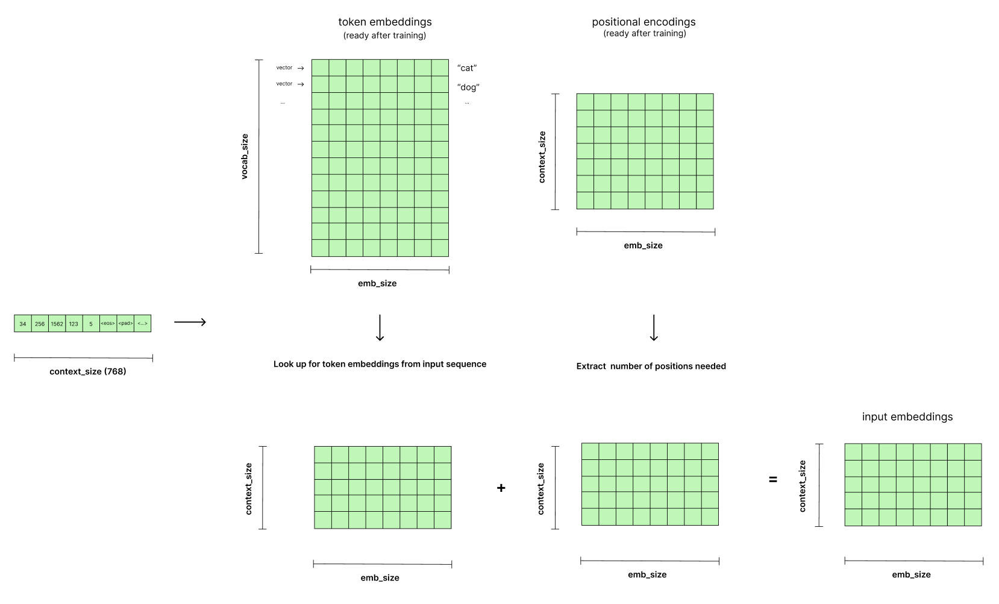
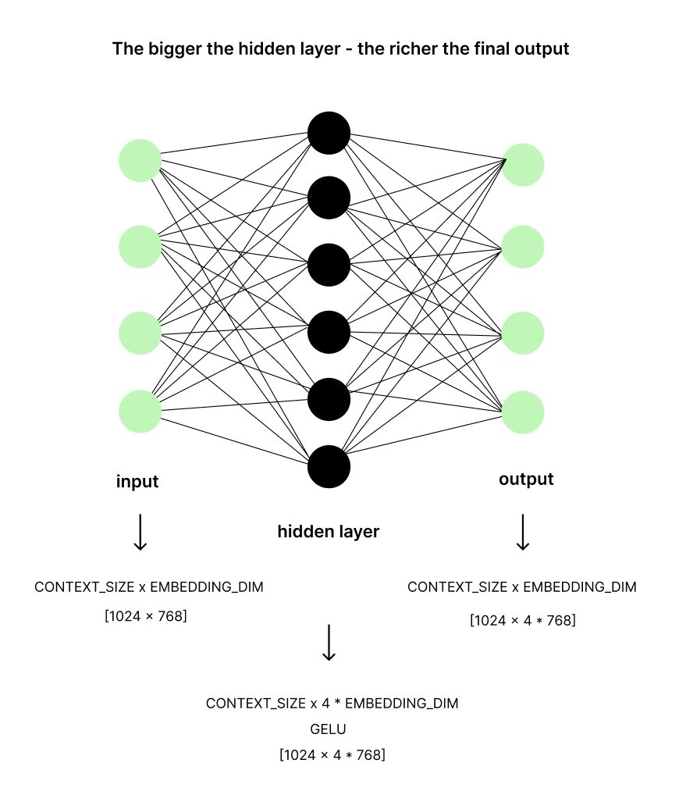
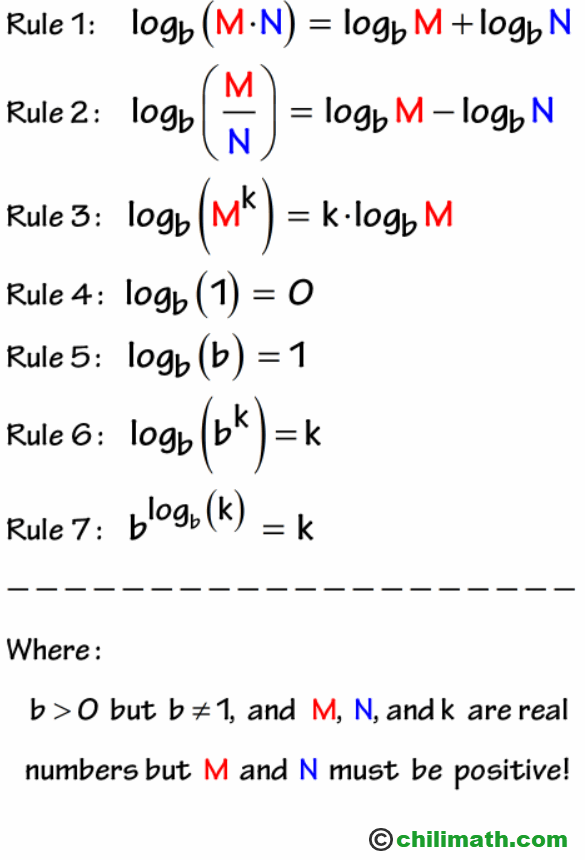
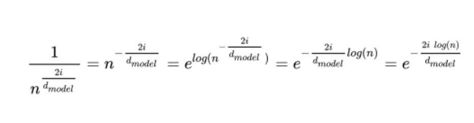

## Transformer architecture

## Learning materials

1. [GPT 2 illustrated article](https://jalammar.github.io/illustrated-gpt2/)
2. [LLM visualizations](https://bbycroft.net/llm)
3. [Positional encoding](https://medium.com/@hunter-j-phillips/positional-encoding-7a93db4109e6)
4. [Open AI implementation](https://github.com/openai/gpt-2)
5. [Role of bias terms in dot product attention](https://assets.amazon.science/59/71/a3cd9863454299633d00d51349dd/role-of-bias-terms-in-dot-product-attention.pdf)
6. [What matters in transformer](https://openreview.net/pdf?id=YLTWwEjkdx)

---

## Embedding layer

Hyperparameters:

- embedding_dim

  - GPT-2 small: 768
  - GPT-2 medium 1024
  - GPT-2 large 1280
  - GPT-2 XL 1600

- context_length
  - GPT-2 small: 768
  - GPT-2 medium 1024
  - GPT-2 large 1280
  - GPT-2 XL 1600

**Positional encoding:**

- each position should have a unique representation
- tensor is a constant tensor, should be saved with a model
- sinusoidal positional encoding uses formula:



**Training:**

1. Init positional encoding matrix with random values
2. Init token embedding matrix with random values

**Inference:**

Token embeddings + positional embeddings = input embeddings

1. Token embeddings lookup. Each index in the token embedding matrix encodes a corresponding token from tokenizer vocabulary.
2. Positional embeddings lookup.
3. Sum of token embeddings and positional embeddings = input embeddings
4. Truncate or pad input embeddings to context length



## Transformer blocks

**Layer Normalization:**

_Purpose_

- stabilize learning
- speedup training
- prevent gradient explosion or vanishing

_Analogue_

Imagine teaching a class of students.

**No Normalization:** Each student's understanding of previous topics is all over the place. Some are way ahead, some are far behind. It's hard to teach new material effectively because you have to constantly adjust to the wildly varying levels of understanding. Some students get overwhelmed (exploding gradients), others get lost and disengaged (vanishing gradients).

**Layer Normalization:** Before teaching each new topic, you give a quick "leveling" exercise to ensure everyone has a roughly similar baseline understanding of the prerequisite concepts. This makes it much easier to teach the new topic effectively and at a faster pace. The students are less likely to get completely lost or overwhelmed, and learning becomes more stable and efficient.

_How it works_

1. Calc the mean:

   Input: [1, 2, 3, 4]
   Output: m = 2.5

2. Calc standard deviation:

   Input: [1, 2, 3, 4]
   Output: st_d = 1.118

3. Normalize:

   x_i_norm = (x_i - m) / st_d
   applying:
   [1, 2, 3, 4] -> [-1.341, -0.447, 0.447, 1.341]

4. Shift and scale:

   x_i_scaled = x_i_norm \* scale + shift
   applying:
   [-1.341, -0.447, 0.447, 1.341] -> [-2.182, -0.394, 1.394, 3.182]

## Self-attention

In current models adding bias is not common practice.

1. Devide into heads
2. Calculating Q, K, V
3. Q \* K / sqrt(d_k) - attention scores
   Each el in resulting matrix is a dot product of Q and K
4. Masking
   filling attention scores with -inf for tokens that should not attend to others
5. Softmax(attention scores) - attention weights
   e^x / sum(e^x)
   why e^x?

   - e^x is always positive
   - e^x is differentiable
   - e^x grows fast when x is positive
   - the derivative of e^x is e^x

   why devide by sum?

   - sum of e^x is always 1 (when you are deviding number by itself it gives you 1)
   - preserving the relative proportions of the input values

6. attention weights \* V - attention output
7. Concatenate attention outputs
8. Linear transformation - output
9. Residual connection

## MLP

Linear - GELU - Linear

1. Linear - expands the dimentions (4x expansion). Allows to get more complex representation of the data. Shape: CONTEXT_SIZE x 4\*EMBEDDING_DIM.
2. GELU. Maintains the shape CONTEXT_SIZE x 4\*EMBEDDING_DIM.
3. Linear - shrinks the dimentions back to CONTEXT_SIZE x EMBEDDING_DIM.



Without GELU even 100 layers of MLP will finally collapse into 1 as each linear layer is just a matrix multiplication.

Example:

1. First layer: y = W_1x +b_1
2. Second layer: z = W_2y + b_2
3. Substitute y into z: z = W_2(W_1x + b_1) + b_2 = W_2W_1x + (W_2b_1 + b_2) => Ax + B => new linear layer

Each new neuron is an additional feature

## Layer normalization

---

## Q&A

**1. When to inherit from nn.Module?**

- when need parameter management
- when include other modules with parameters

**2. When to use register_buffer?**

- when need to save a constant tensor with a model
- when tensor should not receive any gradients during backprop
- the variable will be automatically moved to the device with a model

**3. How to get from original position encoding formula:**


to adaptation in pytorch:

```positions = torch.arange(CONTEXT_SIZE).unsqueeze(1)
        div_term = torch.exp(
            torch.arange(0, EMBEDDING_DIM, 2) * -(torch.log(PE_N) / EMBEDDING_DIM)
        ).unsqueeze(0)

        pe[:, 0::2] = torch.sin(positions * div_term)
        pe[:, 1::2] = torch.cos(positions * div_term)
```

using 

apply transformations:


**4. Why we are applying softmax before multiplying by V in attention head?**

After multiplying Q and K, we get a matrix of attention scores. Those scores should represent the contribution of each vector to the output vector.
After multiplication values are not normalized, so we need to apply softmax to get weighted sum of 1 in each row.
V matrix contains sematic info of each token, so the right approach is to get an appropriate part of V matrix semantic values for each token.
That is what each of Q, K, V matrices means.

- Q - query, search
- K - key, katalog where we are searching, kind of labels
- V - value, semantic info for the search result

**5. When and why to use bias?**

According to the paper [Role of bias terms in dot product attention](https://assets.amazon.science/59/71/a3cd9863454299633d00d51349dd/role-of-bias-terms-in-dot-product-attention.pdf) applying bias b(k) leads to redundunt computations and can be omitted. Ommiting of b(k) bias allow to reduce the number of params by 11% in certain fine-tuning scenarious (BitFit)
While bias b(v) has quite significant impact on model accuracy.

**6. Why we are getting input embeddings by summing token embeddings and positional embeddings (or in residual connections)?**

Allows to fully preserve token embeddings semantic and positional embeddings positional information (save all data)

- Token Embedding: [1, 2, 3]
- Positional Embedding: [3, 2, 1]
- Combined (Layered): [1+3, 2+2, 3+1] = [4, 4, 4]

while:

- multiplication can explode or diminish values to much
- vector for 0 position will end up in 0
- substraction can give us negative numbers, which have unclear semantic meaning

Matrix multiplication reshape and reweight values.

**7. What is the difference between ReLU and GELU?**
ReLU = max(0, x) - 0 instead of negative values or zero

**8. Why do we need V matrix with an info about each token if we already have input embeddings?**

They have different representation spaces.
Input embeddings capture general semantic information while V matrix represents it's meaning optimized for the current layer attention operation. V transormation allows to extract different aspects of the same token.

**9. How mask is applied during inference if there are no future tokens?**

**10. What is a meaning of dot product and matmul in attention?**
