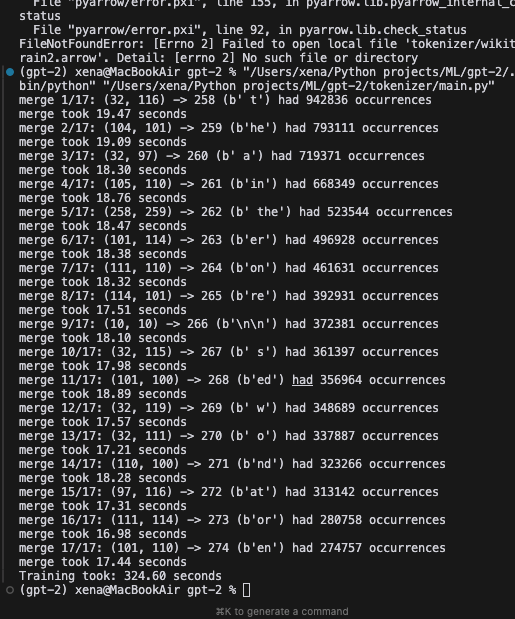
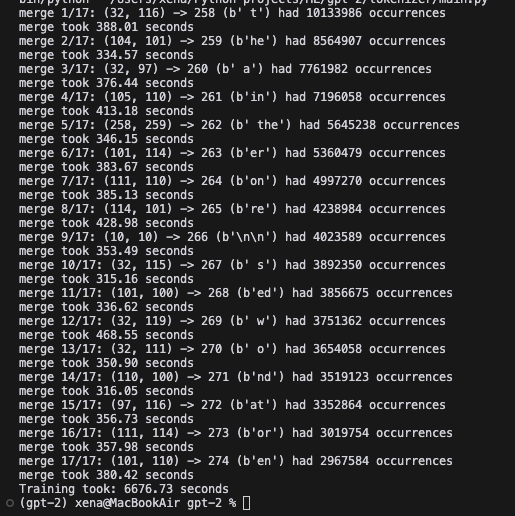

## Learning materials

1. [Neural Machine translation of Rare Words with Subword Units](https://arxiv.org/pdf/1508.07909)
2. [Byte Pair Encoding is Suboptimal for Language Model Pretraining](https://arxiv.org/pdf/2004.03720)
3. [GPT-2 tokenizer](https://github.com/openai/gpt-2/blob/master/src/encoder.py)
4. [Domain-specific tokenization](https://arxiv.org/html/2405.09395v2)

## Why BPE is used?

- shows better results in comparison to word-level tokenization as subword units are more frequent among data and have a bigger chance to be learnt
- do not need to store a big vocabulary
- produce open vocabulary (can handle new words)

The downsides:

- produce morphologically meaningless tokens.
  - Morphologically meaningful tokens
    1. form patterns better then random ones
    2. help to preserve semantics (noun, tense identificator, etc.)
  - might produce redundunt ("junk") pairs
  - better handle new combinations

## Tokenizer

**BPE - Byte Pair Encoding**

_Vocabulary:_

Vocabulary is built iteratively during training.
==Initial vocabulary: raw bytes 0 - 255 + special tokens==

Why?

- Can handle any Unicode character
- No language specific preprocessing
- Efficient storage and processing

English: "Hello" -> [72, 101, 108, 108, 111] # ASCII bytes
Korean: "안녕" -> [236, 149, 136, 235, 133, 149] # UTF-8 bytes
Emoji: "🙂" -> [240, 159, 153, 130] # UTF-8 bytes

_Input:_ raw text
_Output:_ sequence of tokens

Steps:

Training:

1. To "UTF-8"
2. Pair creating and counting
3. Update vocabulary
4. Merge most frequent pair
5. Repeat until vocabulary size is reached

Inference:

1. Identify max_length (context length), batch_size hyperparameters
2. To "UTF-8"
3. Pair creating and counting
4. Convert tokens to IDs (find appropriate pairs in vocabulary)
5. Pad and truncate to max length (context length)
6. Feed to model (each sequence will be processed independently by transformer)

**With regex:**

This tokenizer is using existing regex from GPT-4
Such patterns help to separate numbers, empty spaces, punctuation, etc. to avoid unnecessary merges.

Training:

1. Split text into chunks
2. to utf-8
3. create pairs inside each chunk
4. Count pairs through all the chunks
5. Merge most frequent pair
6. Repeat until vocabulary size is reached

## Dataset choice criteria:

- Domain relevance
  Food recipes + Pubmed publications
- Volume

  _How much compute needed?_

  **Memory**:

  Minimum RAM = 2×corpus_size (holds original + working copy)
  Real-world overhead: Add 30% for Python/OS processes

- Diversity

## Dataset

**General purpose:** wikitext-103
Already devided into train, validation, test files
format: arrow

**Domain-specific:**

- RecipeNGL
  format: csv
- pubmed
  format: scraped text, parquet
  _see the scraping script in the scraping_script.py_

## Experiments

1. Training tokenizer on domain-specific data
2. Training tokenizer on general data

50mb if wiki data, 17 merges, 324,6 sec

 3. Training tokenizer on domain-specific data + general data

500mb of wiki data, 17 merges, 6676,73 sec

Summary:

smaller dataset is 20x faster
17 out of 17 merges are the same

Idea:

Evaluate the performance of the tokenizer on domain-specific data vs general data.
Efficiency metrics:

- Compression ratio
- Tokens per word
- % of unknown tokens

Description:

1. Init vocabulary - 256 + 2 special tokens
2. Data is preprocesssed and cleared from redundant information
3. Regex pattern is the same as for GPT-4 adapted fot a byte sequence
4. Final vocabulary is saved to vocab.json file

Results:
